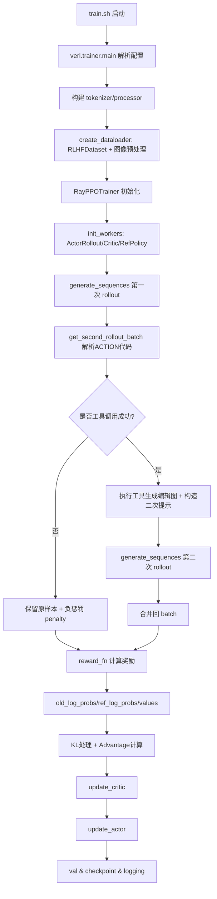
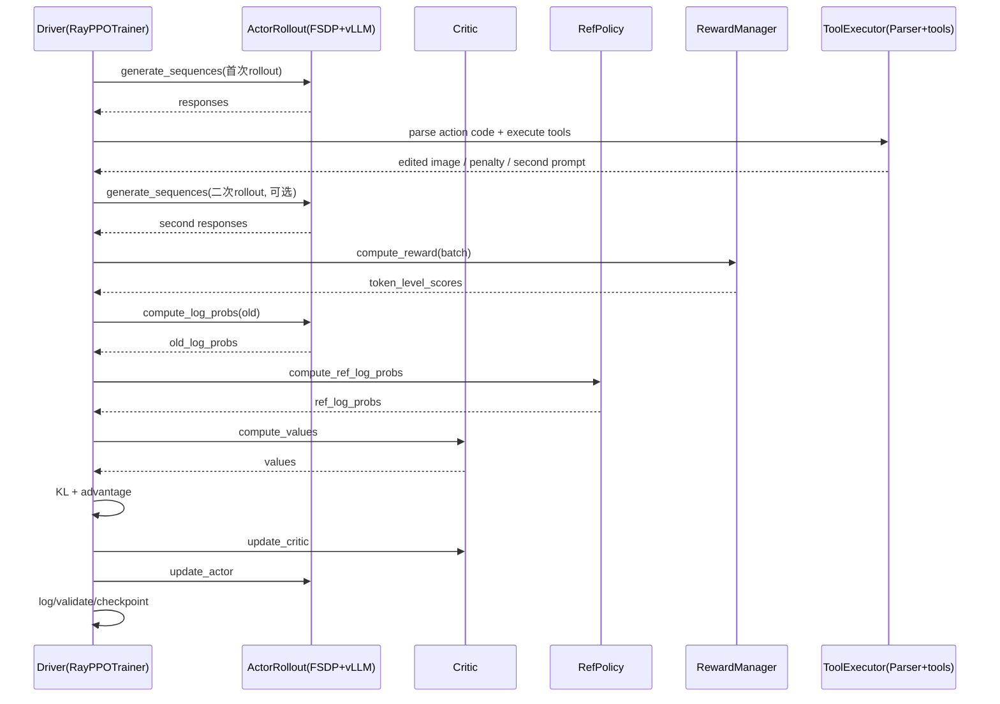

# 多模态 RLAgent（DAPO + VeRL + Think with Images）框架全解析

> 代码基线：`03_mini_chartqa`
> 目标：解释“每一步在做什么 + 为什么这样做 + 涉及知识点”。

## 1. 项目要解决什么问题

这个项目的目标不是普通 VQA，而是让多模态模型在 **图表问答（ChartQA）** 中学会：

1. 先看图推理（reasoning）
2. 必要时调用图像工具（tool use）做局部聚焦
3. 基于工具返回的新图继续回答
4. 用 RL（DAPO 风格 PPO/GRPO）优化策略

核心难点：
- 图表问题常常需要“定位区域 + 数值对比 + 多项汇总”；
- 仅靠一次性端到端生成，容易被图中无关信息干扰；
- 需要把“工具是否该用、怎么用、用完能否提升答案质量”纳入奖励学习。

---

## 2. 端到端训练流程（总览）

---

## 3. 分模块拆解（做什么 + 为什么）

## 3.1 启动与配置层

### 关键文件
- `train.sh`
- `examples/config.yaml`
- `verl/trainer/main.py`
- `verl/trainer/config.py`

### 在做什么
- `train.sh` 设置 CUDA/NCCL/vLLM 环境，调用 `python -m verl.trainer.main`。
- `main.py`：
  - 读取默认 dataclass 配置 + yaml + CLI 覆盖；
  - 初始化 Ray；
  - 创建 `Runner` 远程进程；
  - 构建 tokenizer/processor、dataloader、reward manager、trainer。
- `PPOConfig.deep_post_init()` 自动把数据长度参数写回 rollout 配置，保持一致。

### 为什么这样做
- 配置分层（data/algorithm/worker/trainer）让实验可复现、可扩展；
- Ray 把“控制器”和“分布式 worker”分离，便于横向扩展；
- CLI 覆盖参数支持快速调参（如 batch、GPU 数、模型路径）。

### 知识点
- OmegaConf 结构化配置；
- Ray 远程 actor 模式；
- 多配置源合并（default + file + cli）。

---

## 3.2 数据预处理与样本构造

### 关键文件
- `data/preprocess_data.sh`
- `data/preprocess.py`
- `verl/utils/dataset.py`
- `verl/trainer/data_loader.py`
- `examples/format_prompt/chartQA.jinja`

### 在做什么
1. `preprocess.py`：
   - 读取 `chartqa_vcot/{train,val}.jsonl`；
   - 把 `x_values_bbox/y_values_bbox` 转为可检索 dict；
   - 组织字段：`prompt/query/answer/metadata/figure_path/images`；
   - 写成 parquet（`datasets/train_full.parquet` 等）。
2. `RLHFDataset.__getitem__`：
   - 通过 chat template 组装多模态 prompt（文本 + `<image>`）；
   - 调 processor 得到 `input_ids/attention_mask/position_ids`；
   - 记录 `ground_truth`、`metadata`、`penalty=0`、`rollout_round=0`。
3. `collate_fn` 把 tensor 与 non-tensor 分桶，方便后续 DataProto。

### 为什么这样做
- 把 bbox 元信息显式注入样本，让模型能“可编程地”调用工具聚焦视觉区域；
- 训练阶段需要统一样本结构，便于 rollout/reward/update 链路处理；
- parquet + stateful dataloader 便于大规模读取和断点恢复。

### 知识点
- VLM 输入组织（图像 + 文本）；
- prompt engineering（Jinja 模板）；
- 多模态 token 对齐与长度截断策略。

---

## 3.3 分布式 Worker 架构（VeRL 风格）

### 关键文件
- `verl/trainer/ray_trainer.py`
- `verl/workers/fsdp_workers.py`
- `verl/workers/actor/dp_actor.py`
- `verl/workers/critic/dp_critic.py`
- `verl/workers/rollout/vllm_rollout_spmd.py`

### 在做什么
- `init_workers()` 创建角色：
  - `ActorRollout`（策略 + 采样）
  - `Critic`（价值估计，GAE 时启用）
  - `RefPolicy`（KL 参考策略）
- `FSDPWorker`：
  - HF 模型加载；
  - FSDP 封装（支持 full-shard/offload/rank0_init）；
  - actor/critic/ref 的优化器与调度器；
  - vLLM rollout 引擎；
  - checkpoint 保存/恢复。
- rollout 用 vLLM 生成，训练更新用 FSDP 模型计算 logprob/value。

### 为什么这样做
- rollout 与 update 解耦：vLLM 采样快，FSDP 训练省显存；
- ref policy 独立保持 KL 稳定；
- Actor/Critic 可独立扩展、替换。

### 知识点
- FSDP、参数/优化器 offload、gradient checkpointing；
- vLLM 高吞吐采样；
- RLHF 里 actor/ref/critic 角色分工。

---

## 3.4 Tool Use 与“Think with Images”机制

### 关键文件
- `verl/tooluse/parse.py`
- `verl/tooluse/tools.py`
- `verl/trainer/ray_trainer.py:get_second_rollout_batch`

### 在做什么
1. 第一次 rollout 得到模型输出文本（含 Thought/Action/Answer 风格）。
2. `Parser.parse()` 提取 Python action code（代码块或行级工具调用）。
3. 若检测到工具调用：
   - 把 bbox 与 image 注入执行上下文；
   - 允许调用 `focus_on_*` 系列函数；
   - 执行后捕获编辑图像（`display` 或返回值）；
   - 组装二次 prompt：包含 `OBSERVATION` 与两张图（原图+编辑图）。
4. 第二次 rollout 基于新图再回答；再合并回原 batch。
5. 根据工具调用质量设置 `penalty`（成功 1、失败 -10、直接答 0 等）。

### 为什么这样做
- 把“看图聚焦”显式化，降低视觉噪声；
- 让模型学会“先行动再回答”的代理行为（agentic behavior）；
- 二次 rollout 相当于外部可微分近似之外的“环境交互”。

### 知识点
- Tool-augmented VLM；
- Program-of-thought / code-action parsing；
- 两阶段决策（Action 阶段 + Final answer 阶段）。

---

## 3.5 奖励建模与评估

### 关键文件
- `verl/workers/reward/function.py`
- `examples/reward_function/refocus.py`
- `examples/reward_function/refocus_llm.py`
- `judge/judge_prompt.txt`

### 在做什么
- RewardManager 动态加载 reward 函数（本地文件路径 + 函数名）。
- 支持 4 种 reward 调用形态：
  - sequential
  - batch
  - llm_batch
  - llm_double
- 当前训练脚本用 `batch` + `refocus.py:compute_score`：
  - 解析 `FINAL ANSWER:`；
  - 数值题用相对误差相似度；
  - 多答案按 `||` / `|||` 规则匹配；
  - 输出 `overall`（0~1）。
- 另有 `refocus_llm.py`：用外部 LLM judge 二元判断 `<|YES|>/<|NO|>`。

### 为什么这样做
- 规则奖励稳定、便宜；LLM 奖励灵活、覆盖复杂表达；
- 奖励接口解耦，方便替换 domain-specific scorer。

### 知识点
- Outcome reward（末 token 奖励）；
- rule-based reward vs model-based reward；
- 远程判分服务（OpenRouter / 本地服务）。

---

## 3.6 PPO / DAPO 训练核心

### 关键文件
- `verl/trainer/ray_trainer.py:fit`
- `verl/trainer/core_algos.py`
- `verl/workers/actor/dp_actor.py`
- `verl/workers/critic/dp_critic.py`

### 在做什么
1. 生成样本并计算奖励（含可选 online filtering）。
2. 计算：
   - `old_log_probs`（当前策略冻结视角）
   - `ref_log_probs`（参考策略）
   - `values`（critic）
3. 奖励处理：
   - 可选 KL penalty；
   - `token_level_scores -> token_level_rewards`。
4. 优势估计：支持 `GAE/GRPO/RLOO/REINFORCE++/REMAX`。
5. 更新 critic（MSE + clip）与 actor（PPO clip + dual clip + optional KL loss）。
6. 周期性验证、记录指标、保存 checkpoint。

### 为什么这样做
- 兼容多种 advantage estimator，适配不同监督信号（尤其 outcome reward）；
- DAPO 风格高/低双向 clip 在大模型 RL 中更稳；
- 在线过滤可避免“全好/全坏”样本对更新方向的污染。

### 知识点
- PPO clipped objective；
- KL 控制（fixed/adaptive）；
- GRPO group-normalized 优势；
- sequence length balancing（降低多卡负载不均）。

---

## 3.7 验证、监控与可追溯

### 关键文件
- `verl/trainer/ray_trainer.py:_validate / _maybe_trace_step`
- `verl/trainer/metrics.py`
- `verl/utils/logger/logger.py`

### 在做什么
- 验证阶段也执行二次 rollout + reward；
- 统计工具调用率、成功率；
- 记录 reward/advantage/kl/throughput 等指标；
- 可选 trace：保存 prompt/response/tool code/图片路径到 `trace.jsonl`。

### 为什么这样做
- Agent 类训练最怕“看不见行为细节”，trace 能定位失败模式；
- 指标体系覆盖“质量 + 稳定性 + 性能”。

### 知识点
- 可观测性（observability）在 RL 训练中的必要性；
- 行为指标（tool success）与结果指标（reward）联动。

---

## 4. 一次训练 step 的时序图（细化）

---

## 5. 项目关键创新点（从代码角度）

1. **两阶段 rollout + 图像工具闭环**：不是只在文本里“说会用工具”，而是真执行并回注图像。  
2. **Reward 可插拔设计**：规则奖励和 LLM judge 都能无缝切换。  
3. **多 advantage estimator 共存**：同一框架可跑 GAE/GRPO/RLOO 等。  
4. **VeRL 风格工业化训练栈**：Ray 调度 + FSDP 训练 + vLLM 推理，兼顾吞吐和显存。  
5. **可追踪调试机制**：trace 级别记录工具代码、错误、图像产物，便于迭代 agent 行为。

---

## 6. 你可以重点向面试官解释的“为什么”

- 为什么要二次 rollout：把“看哪里”变成显式行动，降低视觉噪声，提高可解释性。  
- 为什么 reward 只打在末 token：与 outcome reward 一致、实现简单、稳定。  
- 为什么用 GRPO：不强依赖 value 网络，在 group 内做相对比较，适合多采样回答。  
- 为什么要 ref policy + KL：防止策略漂移太快导致能力坍塌。  
- 为什么要 Ray + FSDP + vLLM：训练与推理解耦，兼顾效率与工程可扩展。
