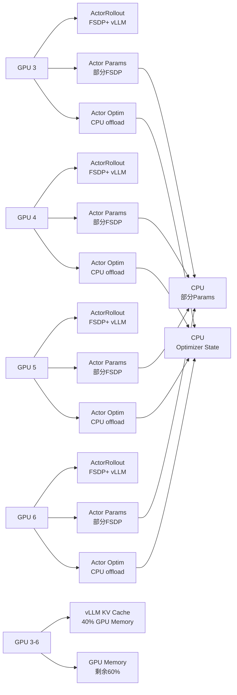

# Mini ChartQA 代码流程详解

> 基于 `train.sh` 配置的完整代码执行流程梳理

---

## 目录

1. [配置概览](#1-配置概览)
2. [整体架构图](#2-整体架构图)
3. [详细执行流程](#3-详细执行流程)
4. [关键模块详解](#4-关键模块详解)
5. [数据流图](#5-数据流图)

---

## 1. 配置概览

### 1.1 train.sh 配置

```bash
#!/bin/bash
set -x

# 环境变量设置
export PYTHONUNBUFFERED=1                                    # Python输出不缓冲
export PYTORCH_CUDA_ALLOC_CONF=expandable_segments:True     # CUDA可扩展内存
export CUDA_DEVICE_ORDER=PCI_BUS_ID                       # GPU顺序
export CUDA_VISIBLE_DEVICES=3,4,5,6                      # 使用4张GPU
export NCCL_P2P_DISABLE=1                                  # 禁用NCCL P2P
export VLLM_ATTENTION_BACKEND=XFORMERS                     # vLLM使用XFormers注意力

MODEL_PATH=Qwen/Qwen2.5-VL-3B-Instruct

# 启动训练
python3 -m verl.trainer.main \
    config=examples/config.yaml \                              # 基础配置文件
    data.train_files=datasets/train_full.parquet \        # 训练数据路径
    data.val_files=datasets/val_full.parquet \            # 验证数据路径
    worker.actor.model.model_path=${MODEL_PATH} \         # 模型路径（覆盖config.yaml）
    worker.rollout.tensor_parallel_size=2 \                 # vLLM张量并行大小（覆盖config.yaml）
    trainer.experiment_name=mini_chartQA \                 # 实验名称（覆盖config.yaml）
    trainer.n_gpus_per_node=4 \                             # 每节点GPU数量（覆盖config.yaml）
    worker.actor.global_batch_size=8 \                        # 全局batch size（覆盖config.yaml）
    worker.actor.micro_batch_size_per_device_for_update=2 \   # 每设备更新时的micro batch size（覆盖config.yaml）
    data.rollout_batch_size=16 \                              # rollout batch size（覆盖config.yaml）
    data.val_batch_size=256 \                                 # 验证batch size（覆盖config.yaml）
    trainer.save_checkpoint_path=./checkpoints/mini_chartQA \  # checkpoint保存路径（覆盖config.yaml）
    worker.reward.reward_type=batch \                        # 奖励类型（覆盖config.yaml）
    worker.reward.reward_function=./examples/reward_function/refocus.py:compute_score  # 奖励函数（覆盖config.yaml）
```

### 1.2 最终配置参数（合并后）

```yaml
# ========== 数据配置 ==========
data:
  train_files: datasets/train_full.parquet          # 训练数据路径
  val_files: datasets/val_full.parquet              # 验证数据路径
  prompt_key: prompt                              # prompt字段名
  answer_key: answer                              # 答案字段名
  image_key: images                               # 图像字段名
  max_prompt_length: 16384                      # 最大prompt长度
  max_response_length: 8192                     # 最大响应长度
  rollout_batch_size: 16                          # rollout batch size
  val_batch_size: 256                           # 验证batch size（覆盖）
  format_prompt: ./examples/format_prompt/chartQA.jinja  # prompt格式化模板
  shuffle: true                                   # 是否打乱数据
  seed: 42                                       # 随机种子
  max_pixels: 4194304                            # 图像最大像素
  min_pixels: 262144                             # 图像最小像素
  filter_overlong_prompts: false                  # 是否过滤过长的prompt

# ========== 算法配置 ==========
algorithm:
  adv_estimator: grpo                             # 优势估计器（GRPO）
  disable_kl: false                                # 是否禁用KL
  use_kl_loss: true                               # 是否使用KL损失
  kl_penalty: low_var_kl                         # KL惩罚类型
  kl_coef: 0.01                                   # KL系数（覆盖）
  online_filtering: true                            # 是否启用在线样本过滤
  filter_key: overall                               # 过滤使用的key
  filter_low: 0.01                                 # 过滤下限（1%分位数）
  filter_high: 0.99                                # 过滤上限（99%分位数）

# ========== Actor配置 ==========
worker:
  actor:
    global_batch_size: 8                         # 全局batch size（覆盖）
    micro_batch_size_per_device_for_update: 2      # 每设备更新时的micro batch size（覆盖）
    micro_batch_size_per_device_for_experience: 8     # 每设备体验时的micro batch size
    max_grad_norm: 1.0                              # 最大梯度范数
    padding_free: true                                # 是否使用padding-free模式
    ulysses_sequence_parallel_size: 1             # Ulysses序列并行大小
    model:
      model_path: Qwen/Qwen2.5-VL-3B-Instruct  # 模型路径（覆盖）
      enable_gradient_checkpointing: true              # 是否启用梯度检查点
      trust_remote_code: false                         # 是否信任远程代码
      freeze_vision_tower: false                      # 是否冻结视觉塔
    optim:
      lr: 1.0e-6                                   # 学习率
      weight_decay: 1.0e-2                           # 权重衰减
      strategy: adamw                                # 优化器策略
      lr_warmup_ratio: 0.0                            # 学习率预热比例
    fsdp:
      enable_full_shard: true                     # 是否启用完全分片
      enable_cpu_offload: false                  # 是否启用CPU卸载
      enable_rank0_init: true                     # 是否rank0初始化
    offload:
      offload_params: true                         # 是否卸载参数
      offload_optimizer: true                     # 是否卸载优化器
    # clip_ratio参数（默认值）
    clip_ratio_low: 0.2                             # PPO下限clip
    clip_ratio_high: 0.3                            # DAPO上限clip
    clip_ratio_dual: 3.0                           # Dual-clip参数

  # ========== Rollout配置 ==========
  rollout:
    n: 5                                            # 每个prompt生成的样本数
    temperature: 1.0                                 # 采样温度
    top_p: 0.99                                      # top-p采样
    gpu_memory_utilization: 0.4                      # GPU内存利用率
    enforce_eager: false                             # 强制eager模式
    enable_chunked_prefill: false                  # 启用chunked prefill
    tensor_parallel_size: 2                           # vLLM张量并行大小（覆盖）
    limit_images: 2                                  # 限制图像数量
    prompt_length: 16384                             # prompt长度（从data.max_prompt_length继承）
    response_length: 8192                            # 响应长度（从data.max_response_length继承）
    val_override_config:                              # 验证时覆盖配置
      temperature: 0.5
      n: 1

  # ========== Ref Policy配置 ==========
  ref:
    fsdp:
      enable_full_shard: true
      enable_cpu_offload: false
      enable_rank0_init: true
    offload:
      offload_params: false                        # 不卸载ref参数

  # ========== Reward配置 ==========
  reward:
    reward_type: batch                           # 奖励类型（覆盖）
    reward_function: ./examples/reward_function/refocus.py:compute_score  # 奖励函数（覆盖）

# ========== Trainer配置 ==========
trainer:
  total_epochs: 2000                             # 总训练轮数
  max_steps: 2000                                  # 最大训练步数
  project_name: mini_chartQA                     # 项目名称
  experiment_name: mini_chartQA                    # 实验名称（覆盖）
  logger: ["console", "wandb"]                     # 日志记录器
  nnodes: 1                                          # 节点数量
  n_gpus_per_node: 4                              # 每节点GPU数量（覆盖）
  val_freq: 2                                       # 验证频率
  val_before_train: true                           # 训练前验证
  val_only: false                                    # 仅验证
  val_generations_to_log: 3                         # 记录生成的验证样本数
  save_freq: 5                                      # 保存频率
  save_limit: 20                                    # 保存限制
  save_checkpoint_path: ./checkpoints/mini_chartQA  # checkpoint保存路径（覆盖）
  load_checkpoint_path: null                         # 加载checkpoint路径
  trace:                                             # 追踪配置
    enable: false
    output_dir: null
    sample_size_per_step: 64
    save_images: true
    max_steps: 200
```

---

## 2. 整体架构图

```mermaid
flowchart TD
    A[train.sh] --> B[python -m verl.trainer.main]
    B --> C[Ray初始化]
    C --> D[创建Runner远程进程]
    D --> E[Runner.run()]
    E --> F[加载配置]
    F --> G[创建Tokenizer/Processor]
    G --> H[创建DataLoader]
    H --> I[初始化ResourcePool]
    I --> J[创建WorkerGroup]
    J --> K[RayPPOTrainer.fit]

    K --> L{选择模式}
    L -->|online_filtering: true| M[在线过滤模式]
    L -->|online_filtering: false| N[离线模式]

    M --> O[生成Batch]
    O --> P{过滤}
    P -->|保留| Q[积累Batch]
    P -->|丢弃| O
    Q -->|达到目标| R[Rollout生成]

    N --> S[从DataLoader获取Batch]
    S --> T[Rollout生成]

    R --> U[第一次Rollout]
    U --> V[解析Tool代码]
    V --> W{解析结果}
    W -->|成功| X[执行Tool]
    W -->|失败| Y[设置Penalty]
    X --> Z[生成编辑图像]
    Z --> AA[第二次Rollout]
    Y --> AB[合并Batch]
    AA --> AB

    T --> AC[第一次Rollout]
    AC --> AD[解析Tool代码]
    AD --> AE{解析结果}
    AE -->|成功| AF[执行Tool]
    AE -->|失败| AG[设置Penalty]
    AF --> AH[生成编辑图像]
    AH --> AI[第二次Rollout]
    AG --> AJ[合并Batch]
    AI --> AJ

    AB --> AK[计算Reward]
    AJ --> AK

    AK --> AL[计算old_log_probs]
    AL --> AM[计算ref_log_probs]
    AM --> AN[计算values]
    AN --> AO[计算Advantage]
    AO --> AP[更新Critic]
    AP --> AQ[更新Actor]
    AQ --> AR[验证/保存/日志]
    AR --> K
```

---

## 3. 详细执行流程

### 3.1 启动阶段

#### 步骤1：train.sh 脚本执行

**文件位置**：`train.sh`

```bash
# 1.1 设置环境变量
export PYTHONUNBUFFERED=1                                    # Python输出不缓冲
export PYTORCH_CUDA_ALLOC_CONF=expandable_segments:True     # CUDA可扩展内存
export CUDA_DEVICE_ORDER=PCI_BUS_ID                       # GPU顺序
export CUDA_VISIBLE_DEVICES=3,4,5,6                      # 使用4张GPU（3,4,5,6号）
export NCCL_P2P_DISABLE=1                                  # 禁用NCCL P2P（多机通信）
export VLLM_ATTENTION_BACKEND=XFORMERS                     # vLLM使用XFormers注意力后端

# 1.2 调用Python模块
python3 -m verl.trainer.main \
    config=examples/config.yaml \
    ...
```

**环境变量作用**：
- `CUDA_VISIBLE_DEVICES`：指定可见GPU，仅GPU 3,4,5,6可见
- `NCCL_P2P_DISABLE=1`：禁用P2P直接通信，使用ring-allreduce
- `VLLM_ATTENTION_BACKEND=XFORMERS`：vLLM使用XFormers高效注意力实现

#### 步骤2：main.py 入口

**文件位置**：`verl/trainer/main.py`

```python
def main():
    # 2.1 解析CLI参数
    cli_args = OmegaConf.from_cli()

    # 2.2 加载默认配置
    default_config = OmegaConf.structured(PPOConfig())

    # 2.3 合并配置：默认 -> YAML -> CLI
    if hasattr(cli_args, "config"):
        config_path = cli_args.pop("config", None)
        file_config = OmegaConf.load(config_path)
        default_config = OmegaConf.merge(default_config, file_config)

    ppo_config = OmegaConf.merge(default_config, cli_args)
    ppo_config = OmegaConf.to_object(ppo_config)

    # 2.4 深度后处理
    ppo_config.deep_post_init()  # 同步各配置参数（如prompt_length）

    # 2.5 初始化Ray
    if not ray.is_initialized():
        runtime_env = {
            "env_vars": {
                "TOKENIZERS_PARALLELISM": "true",
                "NCCL_DEBUG": "WARN",
                "VLLM_LOGGING_LEVEL": "WARN",
                "TORCH_NCCL_AVOID_RECORD_STREAMS": "1",
                "PYTORCH_CUDA_ALLOC_CONF": "expandable_segments:False",
                "PYTHONUNBUFFERED": "1",
            }
        }
        ray.init(runtime_env=runtime_env)

    # 2.6 创建远程Runner并执行
    runner = Runner.remote()
    ray.get(runner.run.remote(ppo_config))
```

**配置合并优先级**：`CLI参数 > YAML文件 > 默认值`

#### 步骤3：Runner.run() 初始化

**文件位置**：`verl/trainer/main.py:34`

```python
@ray.remote(num_cpus=1)
class Runner:
    def run(self, config: PPOConfig):
        # 3.1 打印配置
        print(json.dumps(config.to_dict(), indent=2))

        # 3.2 创建Tokenizer
        tokenizer = get_tokenizer(
            config.worker.actor.model.model_path,  # Qwen/Qwen2.5-VL-3B-Instruct
            override_chat_template=config.data.override_chat_template,
            trust_remote_code=config.worker.actor.model.trust_remote_code,
            use_fast=True,
        )

        # 3.3 创建Processor（多模态）
        processor = get_processor(
            config.worker.actor.model.model_path,
            override_chat_template=config.data.override_chat_template,
            trust_remote_code=config.worker.actor.model.trust_remote_code,
            use_fast=True,
        )

        # 3.4 定义Worker类型映射
        role_worker_mapping = {
            Role.ActorRollout: ray.remote(FSDPWorker),
            Role.Critic: ray.remote(FSDPWorker),
            Role.RefPolicy: ray.remote(FSDPWorker),
        }

        # 3.5 创建资源池
        resource_pool_spec = {"global_pool": [4]}  # 4张GPU
        resource_pool_manager = ResourcePoolManager(
            resource_pool_spec=resource_pool_spec,
            mapping={
                Role.ActorRollout: "global_pool",
                Role.Critic: "global_pool",
                Role.RefPolicy: "global_pool",
            }
        )

        # 3.6 创建Reward Manager
        RewardManager = BatchFunctionRewardManager  # 根据reward_type选择
        RemoteRewardManager = ray.remote(RewardManager).options(num_cpus=1)
        reward_fn = RemoteRewardManager.remote(config.worker.reward, tokenizer)
        val_reward_fn = RemoteRewardManager.remote(config.worker.reward, tokenizer)

        # 3.7 创建DataLoader
        train_dataloader, val_dataloader = create_dataloader(
            config.data,
            tokenizer,
            processor,
        )

        # 3.8 创建Trainer
        trainer = RayPPOTrainer(
            config=config,
            tokenizer=tokenizer,
            processor=processor,
            train_dataloader=train_dataloader,
            val_dataloader=val_dataloader,
            role_worker_mapping=role_worker_mapping,
            resource_pool_manager=resource_pool_manager,
            ray_worker_group_cls=RayWorkerGroup,
            reward_fn=reward_fn,
            val_reward_fn=val_reward_fn,
        )

        # 3.9 初始化Worker
        trainer.init_workers()

        # 3.10 开始训练
        trainer.fit()
```

---

### 3.2 初始化阶段

#### 步骤4：create_dataloader

**文件位置**：`verl/trainer/data_loader.py:26`

```python
def create_dataloader(config: DataConfig, tokenizer, processor):
    # 4.1 创建训练集
    train_dataset = RLHFDataset(
        data_path=config.train_files,  # datasets/train_full.parquet
        tokenizer=tokenizer,
        processor=processor,
        prompt_key="prompt",
        answer_key="answer",
        image_key="images",
        max_prompt_length=16384,
        truncation="right",
        format_prompt="./examples/format_prompt/chartQA.jinja",
        min_pixels=262144,
        max_pixels=4194304,
        filter_overlong_prompts=False,
    )

    # 4.2 创建采样器
    if config.shuffle:
        train_dataloader_generator = torch.Generator()
        train_dataloader_generator.manual_seed(42)
        sampler = RandomSampler(data_source=train_dataset, generator=train_dataloader_generator)
    else:
        sampler = SequentialSampler(data_source=train_dataset)

    # 4.3 创建StatefulDataLoader（支持checkpoint恢复）
    train_dataloader = StatefulDataLoader(
        dataset=train_dataset,
        batch_size=16,  # rollout_batch_size
        sampler=sampler,
        num_workers=8,
        collate_fn=collate_fn,
        pin_memory=False,
        drop_last=True,
    )

    # 4.4 创建验证集（类似）
    val_dataloader = StatefulDataLoader(
        dataset=val_dataset,
        batch_size=256,  # val_batch_size
        shuffle=False,
        num_workers=8,
        collate_fn=collate_fn,
        pin_memory=False,
        drop_last=False,
    )

    return train_dataloader, val_dataloader
```

#### 步骤5：RLHFDataset数据集

**文件位置**：`verl/utils/dataset.py:82`

```python
class RLHFDataset(Dataset, ImageProcessMixin):
    def __getitem__(self, index):
        # 5.1 获取原始样本
        example: dict = self.dataset[index]

        # 5.2 构建消息
        messages = self._build_messages(example)
        # {
        #   "role": "user",
        #   "content": [
        #       {"type": "image"},
        #       {"type": "text", "text": "<prompt_text>"}
        #   ]
        # }

        # 5.3 处理图像
        if self.image_key in example:
            # 应用chat template
            prompt = self.processor.apply_chat_template(
                messages, add_generation_prompt=True, tokenize=False
            )

            # 处理图像（resize）
            images = [self.process_image(img) for img in example["images"]]
            # 根据max_pixels/min_pixels调整大小

            # processor处理
            model_inputs = self.processor(images, [prompt], add_special_tokens=False, return_tensors="pt")
            input_ids = model_inputs.pop("input_ids")[0]
            attention_mask = model_inputs.pop("attention_mask")[0]

            # 多模态数据
            example["multi_modal_data"] = {"image": images}
            example["multi_modal_inputs"] = dict(model_inputs)
        else:
            prompt = self.tokenizer.apply_chat_template(messages, add_generation_prompt=True, tokenize=False)
            model_inputs = self.tokenizer([prompt], add_special_tokens=False, return_tensors="pt")
            input_ids = model_inputs.pop("input_ids")[0]
            attention_mask = model_inputs.pop("attention_mask")[0]

        # 5.4 计算position_ids（Qwen2-VL特有mrope）
        if self.processor.__class__.__name__ == "Qwen2VLImageProcessor":
            position_ids = get_rope_index(
                self.processor,
                input_ids=input_ids,
                image_grid_thw=model_inputs.get("image_grid_thw"),
                attention_mask=attention_mask,
            )  # (3, seq_length)
        else:
            position_ids = torch.clip(attention_mask.cumsum(dim=0) - 1, min=0, max=None)

        # 5.5 后处理（pad/truncate）
        input_ids, attention_mask, position_ids = VF.postprocess_data(
            input_ids=input_ids,
            attention_mask=attention_mask,
            position_ids=position_ids,
            max_length=16384,
            pad_token_id=self.tokenizer.pad_token_id,
            left_pad=True,
            truncation="right",
        )

        # 5.6 保存raw_prompt_ids
        raw_prompt_ids = self.tokenizer.encode(prompt, add_special_tokens=False)
        if len(raw_prompt_ids) > 16384:
            raw_prompt_ids = raw_prompt_ids[:16384]

        # 5.7 返回样本
        example["input_ids"] = input_ids
        example["attention_mask"] = attention_mask
        example["position_ids"] = position_ids
        example["raw_prompt_ids"] = raw_prompt_ids
        example["ground_truth"] = example["answer"]
        example["metadata"] = example["metadata"]  # bbox信息
        example["penalty"] = 0
        example["rollout_round"] = 0

        return example
```

**collate_fn** (`verl/utils/dataset.py:35`)：
- 分离tensor和non-tensor
- tensor使用torch.stack
- non-tensor使用numpy.array

#### 步骤6：RayPPOTrainer.__init__

**文件位置**：`verl/trainer/ray_trainer.py:201`

```python
def __init__(self, config, tokenizer, processor, train_dataloader, val_dataloader, ...):
    # 6.1 保存配置
    self.tokenizer = tokenizer
    self.processor = processor
    self.train_dataloader = train_dataloader
    self.val_dataloader = val_dataloader
    self.config = config
    self.reward_fn = reward_fn
    self.val_reward_fn = val_reward_fn

    # 6.2 初始化Tool Parser
    self.tool_parser = Parser()

    # 6.3 初始化KL控制器
    if Role.RefPolicy in role_worker_mapping and not config.algorithm.disable_kl:
        self.use_reference_policy = True
        self.kl_ctrl = core_algos.get_kl_controller(config.algorithm)
        # FixedKLController(kl_coef=0.01)
    else:
        self.use_reference_policy = False
        self.kl_ctrl = core_algos.FixedKLController(init_kl_coef=0.0)

    # 6.4 确定是否使用Critic
    if config.algorithm.adv_estimator == "gae":
        self.use_critic = True
    else:  # grpo, rloo, reinforce++, remax
        self.use_critic = False

    # 6.5 计算训练步数
    if config.trainer.max_steps is not None:
        self.training_steps = 2000
    else:
        self.training_steps = len(train_dataloader) * 2000
```

#### 步骤7：init_workers 初始化Worker

**文件位置**：`verl/trainer/ray_trainer.py:1111`

```python
def init_workers(self) -> None:
    # 7.1 创建资源池
    self.resource_pool_manager.create_resource_pool()

    # 7.2 定义Worker类映射
    resource_pool_to_cls = {}
    for resource_pool in ["global_pool"]:
        actor_rollout_cls = RayClassWithInitArgs(
            cls=FSDPWorker,  # worker类型
            config=self.config.worker,
            role="actor_rollout"
        )
        resource_pool_to_cls[resource_pool]["actor_rollout"] = actor_rollout_cls

    # 7.3 创建WorkerGroup
    for resource_pool, class_dict in resource_pool_to_cls.items():
        worker_dict_cls = create_colocated_worker_cls(class_dict=class_dict)
        wg_dict = self.ray_worker_group_cls(resource_pool=resource_pool, ray_cls_with_init=worker_dict_cls)
        spawn_wg = wg_dict.spawn(prefix_set=class_dict.keys())
        # spawn_wg = {"actor_rollout": WorkerGroup实例}

    # 7.4 初始化Worker
    self.actor_rollout_wg = spawn_wg["actor_rollout"]
    self.actor_rollout_wg.init_model()  # 初始化FSDP模型
```

#### 步骤8：FSDPWorker初始化

**文件位置**：`verl/workers/fsdp_workers.py:63`

```python
class FSDPWorker(Worker):
    def __init__(self, config: WorkerConfig, role: str):
        # 8.1 初始化分布式
        if not dist.is_initialized():
            dist.init_process_group(backend="nccl")

        self.rank = int(os.getenv("RANK", "0"))

        # 8.2 确定角色
        self._is_actor = role in ["actor", "actor_rollout", "actor_rollout_ref"]
        self._is_critic = role == "critic"
        self._is_ref = role in ["ref", "actor_rollout_ref"]

        # 8.3 配置offload
        self._use_param_offload = config.actor.offload.offload_params  # true
        self._use_optimizer_offload = config.actor.offload.offload_optimizer  # true

        # 8.4 创建device mesh
        world_size = 4  # 4张GPU
        self.device_mesh = init_device_mesh(
            "cuda",
            mesh_shape=(world_size,),  # (4,)
            mesh_dim_names=("fsdp",)
        )

        # 8.5 计算batch size
        if self._is_actor:
            config.global_batch_size_per_device = (
                config.global_batch_size // world_size  # 8 // 4 = 2
            )
            config.global_batch_size_per_device_for_update = (
                config.global_batch_size // world_size  # 8 // 4 = 2
            )
```

#### 步骤9：init_model 初始化模型

**文件位置**：`verl/workers/fsdp_workers.py:147`

```python
def _build_model_optimizer(self, model_config, fsdp_config, optim_config):
    # 9.1 加载模型
    model = AutoModelForVision2Seq.from_pretrained(
        model_config.model_path,  # Qwen/Qwen2.5-VL-3B-Instruct
        trust_remote_code=model_config.trust_remote_code,
        torch_dtype=torch.bfloat16,
        device_map="cpu",  # 先加载到CPU
    )

    # 9.2 创建optimizer
    optimizer = AnyPrecisionAdamW(
        params=[],
        lr=1.0e-6,
        weight_decay=1.0e-2,
    )

    # 9.3 配置FSDP wrap policy
    fsdp_wrap_policy = get_fsdp_wrap_policy(
        model=model,
        module_names_to_wrap=["q_proj", "k_proj", "v_proj", "gate_proj", "up_proj", "down_proj"],
    )

    # 9.4 FSDP包装
    if fsdp_config.enable_full_shard:
        sharding_strategy = ShardingStrategy.FULL_SHARD
    else:
        sharding_strategy = ShardingStrategy.SHARD_GRAD_OP

    model = FSDP(
        model,
        sharding_strategy=sharding_strategy,
        cpu_offload=CPUOffload(
            offload_params=fsdp_config.enable_cpu_offload,  # false
        ),
        mixed_precision=MixedPrecision.BF16,
        device_id=torch.cuda.current_device(),
    )

    # 9.5 offload到CPU
    if self._use_param_offload:
        offload_fsdp_model(model)
    if self._use_optimizer_offload:
        offload_fsdp_optimizer(optimizer)

    # 9.6 初始化vLLM rollout引擎
    self.rollout = vLLMRollout(
        model_path=model_config.model_path,
        config=self.config.rollout,
        tokenizer=tokenizer,
    )
```

#### 步骤10：vLLMRollout初始化

**文件位置**：`verl/workers/rollout/vllm_rollout_spmd.py:50`

```python
class vLLMRollout(BaseRollout):
    def __init__(self, model_path: str, config: RolloutConfig, tokenizer: PreTrainedTokenizer):
        self.rank = int(os.getenv("RANK", "0"))
        self.pad_token_id = tokenizer.pad_token_id

        # 10.1 创建vLLM推理引擎
        self.inference_engine = LLM(
            model=model_path,
            skip_tokenizer_init=False,
            trust_remote_code=config.trust_remote_code,
            load_format="dummy",
            dtype="bfloat16",
            seed=config.seed,
            max_model_len=16384 + 8192,  # prompt_length + response_length
            distributed_executor_backend="external_launcher",
            tensor_parallel_size=2,  # config.tensor_parallel_size
            gpu_memory_utilization=0.4,
            max_num_batched_tokens=8192,
            disable_log_stats=config.disable_log_stats,
            enforce_eager=config.enforce_eager,
            disable_custom_all_reduce=True,
            limit_mm_per_prompt={"image": 2},  # config.limit_images
            disable_mm_preprocessor_cache=True,
            enable_chunked_prefill=config.enable_chunked_prefill,
            enable_sleep_mode=True,
        )

        # 10.2 offload vLLM模型以减少内存
        self.inference_engine.sleep(level=1)

        # 10.3 配置采样参数
        sampling_kwargs = {
            "max_tokens": 8192,
            "detokenize": False,
            "logit_bias": _get_logit_bias(model_path, trust_remote_code=False),
            "temperature": 1.0,
            "top_p": 0.99,
            "n": 5,  # 每个prompt生成5个样本
        }
        self.sampling_params = SamplingParams(**sampling_kwargs)
```

---

### 3.3 训练循环（在线过滤模式）

**文件位置**：`verl/trainer/ray_trainer.py:1369`

```python
def fit(self):
    # 3.1 初始化logger
    self.logger = Tracker(loggers=self.config.trainer.logger, config=self.config.to_dict())
    self.global_step = 0

    # 3.2 加载checkpoint
    self._load_checkpoint()

    # 3.3 训练前验证
    if self.val_reward_fn is not None and self.config.trainer.val_before_train:
        val_metrics = self._validate()
        self.logger.log(data=val_metrics, step=self.global_step)

    # 3.4 在线过滤模式
    if self.config.algorithm.online_filtering:
        self.data_iterator = iter(self.train_dataloader)
        while self.global_step < 2000:
            self.global_step += 1
            metrics, timing_raw = {}, {}

            with timer("step", timing_raw):
                # ---------- 阶段1：生成Batch ----------
                with timer("gen", timing_raw):
                    batch = self._make_batch_data_online_filtering(metrics)

                # ---------- 阶段2：计算Reward ----------
                with timer("reward", timing_raw):
                    reward_tensor, reward_metrics = ray.get(self.reward_fn.compute_reward.remote(batch))

                # ---------- 阶段3：trace ----------
                self._maybe_trace_step(batch, reward_tensor, reward_metrics)
                batch.batch = batch.batch.clone()
                batch.batch.set("token_level_scores", reward_tensor)

                # ---------- 阶段4：平衡Batch ----------
                self._balance_batch(batch, metrics=metrics)

                # ---------- 阶段5：计算log_probs ----------
                with timer("old", timing_raw):
                    old_log_probs = self.actor_rollout_wg.compute_log_probs(batch)
                    batch = batch.union(old_log_probs)

                # ---------- 阶段6：计算ref_log_probs ----------
                if self.use_reference_policy:
                    with timer("ref", timing_raw):
                        ref_log_probs = self.ref_policy_wg.compute_ref_log_probs(batch)
                        batch = batch.union(ref_log_probs)

                # ---------- 阶段7：计算values（GRPO不需要）----------
                if self.use_critic:  # false（因为adv_estimator=grpo）
                    with timer("values", timing_raw):
                        values = self.critic_wg.compute_values(batch)
                        batch = batch.union(values)

                # ---------- 阶段8：计算Advantage ----------
                with timer("adv", timing_raw):
                    reward_metrics = {f"reward/{k}": v for k, v in reduce_metrics(reward_metrics).items()}
                    metrics.update(reward_metrics)

                    if not self.config.algorithm.use_kl_loss and self.use_reference_policy:
                        batch, kl_metrics = apply_kl_penalty(batch, self.kl_ctrl, self.config.algorithm.kl_penalty)
                        metrics.update(kl_metrics)
                    else:
                        batch.batch = batch.batch.clone()
                        batch.batch.set("token_level_rewards", batch.batch["token_level_scores"])

                    batch = compute_advantage(
                        batch,
                        adv_estimator="grpo",  # config.algorithm.adv_estimator
                        gamma=1.0,
                        lam=1.0,
                    )

                # ---------- 阶段9：更新Critic ----------
                if self.use_critic:  # false
                    with timer("update_critic", timing_raw):
                        critic_output = self.critic_wg.update_critic(batch)
                        critic_metrics = reduce_metrics(critic_output.non_tensor_batch)
                        metrics.update(critic_metrics)

                # ---------- 阶段10：更新Actor ----------
                if self.config.trainer.critic_warmup <= self.global_step:
                    with timer("update_actor", timing_raw):
                        actor_output = self.actor_rollout_wg.update_actor(batch)
                        actor_metrics = reduce_metrics(actor_output.non_tensor_batch)
                        metrics.update(actor_metrics)

                # ---------- 阶段11：验证 ----------
                if (
                    self.val_reward_fn is not None
                    and self.config.trainer.val_freq > 0
                    and self.global_step % self.config.trainer.val_freq == 0
                ):
                    with timer("validation", timing_raw):
                        val_metrics = self._validate()
                    metrics.update(val_metrics)

                # ---------- 阶段12：保存checkpoint ----------
                if self.config.trainer.save_freq > 0 and self.global_step % self.config.trainer.save_freq == 0:
                    with timer("save_checkpoint", timing_raw):
                        self._save_checkpoint()

            # 3.5 记录metrics
            num_gpus = 4
            metrics.update(compute_data_metrics(batch=batch, use_critic=self.use_critic))
            metrics.update(compute_timing_metrics(batch=batch, timing_raw=timing_raw))
            metrics.update(compute_throughout_metrics(batch=batch, timing_raw=timing_raw, num_gpus=num_gpus))
            self.logger.log(data=metrics, step=self.global_step)
```

---

### 3.4 在线过滤流程

**文件位置**：`verl/trainer/ray_trainer.py:1246`

```python
def _make_batch_data_online_filtering(self, metrics) -> DataProto:
    batch = None
    num_try_make_batch = 0

    while True:
        num_try_make_batch += 1

        # 4.1 获取一个batch
        try:
            batch_dict = next(self.data_iterator)
        except StopIteration:
            self.data_iterator = iter(self.train_dataloader)
            batch_dict = next(self.data_iterator)

        # 4.2 创建DataProto
        new_batch: DataProto = DataProto.from_single_dict(batch_dict)
        new_batch.non_tensor_batch["uid"] = np.array([str(uuid.uuid4()) for _ in range(len(new_batch))], dtype=object)

        # 4.3 准备PIL图像
        if "multi_modal_data" in new_batch.non_tensor_batch.keys():
            mm = new_batch.non_tensor_batch.get("multi_modal_data", None)
            if mm is not None and "image_1_pil" not in new_batch.non_tensor_batch:
                image_1_pil = []
                for item in mm:
                    img0 = None
                    if isinstance(item, dict):
                        imgs = item.get("image", None)
                        if isinstance(imgs, list) and len(imgs) > 0 and isinstance(imgs[0], Image.Image):
                            img0 = imgs[0]
                    image_1_pil.append(img0)
                new_batch.non_tensor_batch["image_1_pil"] = np.array(image_1_pil, dtype=object)

        # 4.4 准备rollout batch
        gen_batch = new_batch.pop(
            batch_keys=["input_ids", "attention_mask", "position_ids"],
            non_tensor_batch_keys=["raw_prompt_ids", "multi_modal_data"],
        )

        # 4.5 第一次rollout
        gen_batch_output = self.actor_rollout_wg.generate_sequences(gen_batch)

        # 4.6 repeat（GRPO需要）
        new_batch = new_batch.repeat(repeat_times=5, interleave=True)  # n=5
        new_batch = new_batch.union(gen_batch_output)

        # 4.7 第二次rollout（如果需要）
        # 调用get_second_rollout_batch

        # 4.8 计算reward
        reward_tensor, reward_metrics = ray.get(self.reward_fn.compute_reward.remote(new_batch))
        new_batch.batch = new_batch.batch.clone()
        new_batch.batch.set("token_level_scores", reward_tensor)

        # 4.9 过滤
        filter_scores = reward_metrics.get("overall", None)  # filter_key="overall"
        uids = new_batch.non_tensor_batch["uid"]
        uid2scores = defaultdict(list)
        for uid, score in zip(uids, filter_scores):
            uid2scores[uid].append(score)

        # 计算每个uid的平均score
        uid2mean = {uid: float(np.mean(scores)) for uid, scores in uid2scores.items()}

        # 过滤：只保留0.01 < score < 0.99的样本
        kept_uids = [
            uid
            for uid, avg_score in uid2mean.items()
            if avg_score > 0.01 and avg_score < 0.99
        ]

        kept_sample_idxs = [idx for idx, uid in enumerate(uids) if uid in kept_uids]
        if len(kept_sample_idxs) == 0:
            raise RuntimeError("No sample is kept after filtering. Please check your data.")

        # 4.10 重排
        new_batch.reorder(torch.tensor(kept_sample_idxs, dtype=torch.long))

        # 4.11 合并batch
        batch = DataProto.concat([batch, new_batch]) if batch is not None else new_batch
        current_batch_size = len(batch) // 5  # 每个uid有5个样本
        rollout_batch_size = 16

        # 4.12 判断是否达到目标大小
        if current_batch_size < rollout_batch_size:
            max_try_make_batch = 20
            if num_try_make_batch < max_try_make_batch:
                continue  # 继续生成
            else:
                raise RuntimeError(f"{num_try_make_batch=} >= {max_try_make_batch=}. Generated too many.")
        else:
            return batch[: 16 * 5]  # 返回16个prompt * 5个样本 = 80个样本
```

---

### 3.5 Rollout生成流程

**文件位置**：`verl/workers/rollout/vllm_rollout_spmd.py:122`

```python
@torch.no_grad()
def generate_sequences(self, prompts: DataProto) -> DataProto:
    # 5.1 准备输入
    input_ids: torch.Tensor = prompts.batch["input_ids"]  # (bs, prompt_length)
    attention_mask: torch.Tensor = prompts.batch["attention_mask"]
    position_ids: torch.Tensor = prompts.batch["position_ids"]
    eos_token_id: int = prompts.meta_info["eos_token_id"]
    batch_size = input_ids.size(0)

    non_tensor_batch = prompts.non_tensor_batch

    # 5.2 准备vLLM输入
    if "multi_modal_data" in non_tensor_batch:
        vllm_inputs = []
        for raw_prompt_ids, multi_modal_data in zip(
            non_tensor_batch.pop("raw_prompt_ids"),
            non_tensor_batch.pop("multi_modal_data")
        ):
            vllm_inputs.append({
                "prompt_token_ids": list(raw_prompt_ids),
                "multi_modal_data": multi_modal_data,
            })
    else:
        vllm_inputs = [
            {"prompt_token_ids": list(raw_prompt_ids)}
            for raw_prompt_ids in non_tensor_batch.pop("raw_prompt_ids")
        ]

    # 5.3 生成
    with self.update_sampling_params(**prompts.meta_info):  # 更新temperature, n等
        completions: List[RequestOutput] = self.inference_engine.generate(
            prompts=vllm_inputs,
            sampling_params=self.sampling_params,  # temperature=1.0, top_p=0.99, n=5
            use_tqdm=(self.rank == 0)
        )

    # 5.4 处理输出
    batch = {}
    for completion in completions:
        for idx, output in enumerate(completion.outputs):
            # output_ids: (1, seq_len)
            batch.setdefault("responses", []).append(torch.tensor(output.outputs))
            batch.setdefault("logprobs", []).append(torch.tensor(output.logprobs))

    # 5.5 创建response_mask
    responses = torch.stack(batch["responses"], dim=0)  # (bs*n, response_length)
    batch_size = responses.size(0)
    seq_len = responses.size(1)

    # 找到EOS位置
    eos_positions = torch.argmax(
        (responses == eos_token_id).long() * torch.arange(1, seq_len + 1, device=responses.device),
        dim=1,
    )
    response_mask = torch.zeros_like(responses, dtype=torch.bool)
    for i, eos_pos in enumerate(eos_positions):
        response_mask[i, : eos_pos] = True

    batch["response_mask"] = response_mask

    # 5.6 处理pad
    pad_size = (self.world_size - batch_size) % self.world_size
    if pad_size > 0:
        for key in batch.keys():
            batch[key] = torch.cat([batch[key], batch[key][-pad_size:]], dim=0)

    # 5.7 返回DataProto
    return DataProto.from_dict(batch)
```

---

### 3.6 两阶段Rollout（Tool Use）

**文件位置**：`verl/trainer/ray_trainer.py:485`

```python
def get_second_rollout_batch(self, og_output_gen_batch, original_full_batch, append=False, save_images=False):
    # 6.1 获取原始数据
    figure_paths = original_full_batch.non_tensor_batch["figure_path"]
    prompts = original_full_batch.non_tensor_batch["prompt"]
    figure_ids = original_full_batch.non_tensor_batch["figure_id"]
    metadata_batch = original_full_batch.non_tensor_batch["metadata"]

    # 6.2 获取生成的文本
    output_ids = og_output_gen_batch.batch["responses"]
    output_texts = [self.tokenizer.decode(ids, skip_special_tokens=True) for ids in output_ids] # 5*8=40

    # 6.3 解析Tool代码
    parsed_results = [self.tool_parser.parse(output_text) for output_text in output_texts]

    num_tool_calls = 0
    num_direct = 0
    num_success_tool_calls = 0
    num_failed_tool_calls = 0
    edited_images = []

    # 6.4 遍历每个样本
    for idx, result in enumerate(parsed_results):
        # 6.4.1 解析失败
        if not result["status"]:
            if result["error_code"] == "NOTOOL":
                # 直接回答，不使用tool
                num_direct += 1
                original_full_batch.non_tensor_batch["penalty"][idx] = 0
            else:
                # tool代码错误
                original_full_batch.non_tensor_batch["penalty"][idx] = -10
                num_tool_calls += 1
                num_failed_tool_calls += 1
            continue

        # 6.4.2 解析成功
        metadata = json.loads(metadata_batch[idx])
        code = result["content"]

        # 获取bbox信息
        if metadata["type"] == "v_bar":
            bbox_mapping = metadata["x_values_bbox"]
        elif metadata["type"] == "h_bar":
            bbox_mapping = metadata["y_values_bbox"]
        else:
            bbox_mapping = {**metadata["x_values_bbox"], **metadata["y_values_bbox"]}

        # 6.4.3 检查是否提到tool
        mentions_any_tool = any(
            (f"{name}(" in code or f"{name} (" in code)
            for name in ["focus_on_columns_with_mask", "focus_on_rows_with_mask", ...]
        )
        if not mentions_any_tool:
            # 没有调用tool
            num_direct += 1
            original_full_batch.non_tensor_batch["penalty"][idx] = 0
            continue

        num_tool_calls += 1

        # 6.4.4 准备执行上下文
        context = self.get_tool_context()
        context["columns_bbox"] = bbox_mapping
        context["rows_bbox"] = bbox_mapping

        # 获取原始图像
        base_image = original_full_batch.non_tensor_batch.get("image_1_pil", None)[idx]

        # 6.4.5 执行代码
        try:
            exec(code, context)
            successful = True
        except BaseException as e:
            successful = False

        # 6.4.6 检查是否有图像输出
        if successful:
            # 查找context中的PIL Image
            for k, v in context.items():
                if k not in {"image_1", "image"} and isinstance(v, Image.Image):
                    self.captured_output = v
                    break
            if self.captured_output is None:
                successful = False

        # 6.4.7 处理结果
        if successful:
            num_success_tool_calls += 1
            edited_image = self.captured_output

            # 6.4.8 构建第二次prompt
            trim_to_action_end = self.tool_parser.trim_to_action_end(output_texts[idx])
            trim_to_action_end += "\nOBSERVATION: Execution success. The output is as follows:"
            trim_to_action_end += "\n<the image outputs of code is added as second image>"

            # 构建消息：原图 + 编辑图
            messages = self.val_dataloader.dataset.tu_build_message(
                prompts[idx], [None, None], trim_to_action_end
            )

            prompt = self.processor.apply_chat_template(messages, add_generation_prompt=True, tokenize=False)

            # 处理两张图像
            images = [
                self.val_dataloader.dataset.process_image(base_image),
                self.val_dataloader.dataset.process_image(edited_image),
            ]

            model_inputs = self.processor(images, [prompt], add_special_tokens=False, return_tensors="pt")
            input_ids = model_inputs.pop("input_ids")[0]
            attention_mask = model_inputs.pop("attention_mask")[0]
            position_ids = torch.clip(attention_mask.cumsum(dim=0) - 1, min=0, max=None)

            # 后处理
            input_ids, attention_mask, position_ids = VF.postprocess_data(
                input_ids=input_ids,
                attention_mask=attention_mask,
                position_ids=position_ids,
                max_length=16384,
                pad_token_id=self.tokenizer.pad_token_id,
                left_pad=True,
                truncation="right",
            )

            # 构建第二次rollout batch
            second_rollout_data = {
                "multi_modal_data": {"image": images},
                "multi_modal_inputs": dict(model_inputs),
            }
            second_rollout_data["input_ids"] = input_ids.unsqueeze(0)
            second_rollout_data["attention_mask"] = attention_mask.unsqueeze(0)
            second_rollout_data["position_ids"] = position_ids.unsqueeze(0)

            # 6.4.9 第二次rollout
            second_rollout_batch = DataProto.from_dict(second_rollout_batch)
            second_rollout_gen_batch = self.actor_rollout_wg.generate_sequences(second_rollout_batch)

            # 6.4.10 合并到原batch
            for key in second_rollout_gen_batch.batch.keys():
                original_full_batch.batch[key][idx] = second_rollout_gen_batch.batch[key][0]
            for key in second_rollout_gen_batch.non_tensor_batch.keys():
                original_full_batch.non_tensor_batch[key][idx] = second_rollout_gen_batch.non_tensor_batch[key][0]

            edited_images.append(edited_image)
        else:
            # tool执行失败
            original_full_batch.non_tensor_batch["penalty"][idx] = -10
            num_failed_tool_calls += 1

    # 6.5 统计
    stats = {
        "num_tool_calls": num_tool_calls,
        "num_direct": num_direct,
        "num_success_tool_calls": num_success_tool_calls,
        "num_failed_tool_calls": num_failed_tool_calls,
    }

    return original_full_batch, stats
```

---

### 3.7 Reward计算

**文件位置**：`examples/reward_function/refocus.py:45`

```python
def compute_score(predicts: List[str], ground_truths: List[str]) -> List[Dict[str, float]]:
    scores = []
    for predict, ground_truth in zip(predicts, ground_truths):
        # 7.1 解析FINAL ANSWER
        answers = re.findall(r'FINAL ANSWER:\s*(.*?)(?=\.\s|\.?$)', predict)

        overall_score = 0

        # 7.2 分离ground_truth（多个答案用|||分隔）
        sub_gts = ground_truth.split("|||")

        if len(answers) > 0:
            answers = answers[0]

            # 7.3 分离预测答案（多个用||分隔）
            expected_answers = len(sub_gts)
            correct_answers = 0

            for answer in answers.split('||'):
                candidate_scores = []

                # 7.4 对每个ground_truth计算相似度
                for gt in sub_gts:
                    if is_number(gt) and is_number(answer):
                        # 数值相似度
                        gt = float(gt)
                        ans = float(answer)
                        candidate_scores.append(similarity_score(gt, ans))
                    else:
                        # 精确匹配
                        if answer == gt:
                            candidate_scores.append(1)

                # 7.5 取最佳score
                if len(candidate_scores) > 0:
                    correct_answers += max(candidate_scores)

            # 7.6 计算最终score
            if expected_answers == 0:
                expected_answers = 1
            overall_score = correct_answers / expected_answers

        # 7.7 返回score
        scores.append({"overall": overall_score})

    return scores
```

**相似度函数**：
```python
def similarity_score(a, b):
    if a == b:
        return 1.0
    if a == 0 or b == 0:
        return 0.0
    return 1 - (abs(a - b) / max(abs(a), abs(b)))  # 相对误差
```

**Reward Manager调用**：
- `SequentialFunctionRewardManager`：逐个样本计算
- `BatchFunctionRewardManager`：批量计算（当前使用）
- `LLMBatchFunctionRewardManager`：批量调用LLM

---

### 3.8 GRPO Advantage计算

**文件位置**：`verl/trainer/ray_trainer.py:156`

```python
def compute_advantage(data: DataProto, adv_estimator="grpo"):
    token_level_rewards = data.batch["token_level_rewards"]  # (bs*n, response_length)
    response_mask = data.batch["response_mask"]
    index = data.non_tensor_batch["uid"]  # 用于grouping

    if adv_estimator == "grpo":
        advantages, returns = core_algos.compute_grpo_outcome_advantage(
            token_level_rewards, response_mask, index
        )

    data.batch["advantages"] = advantages
    data.batch["returns"] = returns
    return data
```

**GRPO计算** (`verl/trainer/core_algos.py:138`)：
```python
def compute_grpo_outcome_advantage(token_level_rewards, response_mask, index):
    # 8.1 对每个token的reward求和
    scores = token_level_rewards.sum(dim=-1)  # (bs*n,)

    # 8.2 按uid分组
    id2score = defaultdict(list)
    for i in range(scores.shape[0]):
        id2score[index[i]].append(scores[i])

    # 8.3 计算每个group的均值和标准差
    id2mean = {}
    id2std = {}
    for idx in id2score:
        id2mean[idx] = torch.mean(torch.tensor(id2score[idx]))
        id2std[idx] = torch.std(torch.tensor(id2score[idx]))

    # 8.4 归一化：(score - mean) / (std + eps)
    for i in range(scores.shape[0]):
        scores[i] = (scores[i] - id2mean[index[i]]) / (id2std[index[i]] + 1e-6)

    # 8.5 广播到所有token
    returns = scores.unsqueeze(-1) * response_mask
    advantages = returns

    return advantages, returns
```

---

### 3.9 Actor更新

**文件位置**：`verl/workers/actor/dp_actor.py:138`

```python
def update_actor(self, data: DataProto) -> Dict[str, Any]:
    self.actor_module.train()

    metrics = {}

    # 9.1 准备数据
    select_keys = [
        "input_ids", "responses", "attention_mask", "position_ids",
        "old_log_probs", "advantages"
    ]
    if "multi_modal_inputs" in data.non_tensor_batch.keys():
        non_tensor_select_keys = ["multi_modal_inputs"]
    else:
        non_tensor_select_keys = []

    if "ref_log_probs" in data.batch.keys():
        select_keys.append("ref_log_probs")

    # 9.2 切分micro batch
    micro_batches = data.select(
        select_keys, non_tensor_select_keys
    ).split(2)  # micro_batch_size_per_device_for_update

    # 9.3 梯度累积
    gradient_accumulation = 8 / 2 / 4  # global / micro / world_size = 1

    for micro_batch in micro_batches:
        # 9.4 前向传播
        model_inputs = {**micro_batch.batch, **micro_batch.non_tensor_batch}

        log_probs = self._forward_micro_batch(model_inputs, temperature=None)
        # log_probs: (bsz, response_length)

        # 9.5 计算entropy
        response_mask = model_inputs["response_mask"]
        entropy_loss = -VF.masked_mean(log_probs, response_mask)

        # 9.6 计算policy loss（DAPO三重clip）
        pg_loss, pg_clipfrac_higher, pg_clipfrac_lower, ppo_kl = core_algos.compute_policy_loss(
            old_log_probs=model_inputs["old_log_probs"],
            log_probs=log_probs,
            advantages=model_inputs["advantages"],
            response_mask=response_mask,
            clip_ratio_low=0.2,
            clip_ratio_high=0.3,
            clip_ratio_dual=3.0,
        )

        # 9.7 计算KL损失
        if "ref_log_probs" in model_inputs:
            ref_log_probs = model_inputs["ref_log_probs"]
            kld = core_algos.compute_kl(
                log_probs=log_probs,
                ref_log_probs=ref_log_probs,
                kl_penalty="low_var_kl",
            )
            kl_loss = VF.masked_mean(kld, response_mask)
            pg_loss = pg_loss + kl_loss * 0.01  # kl_coef
            metrics["actor/kl_loss"] = kl_loss.detach().item()

        # 9.8 反向传播
        loss = pg_loss / gradient_accumulation
        loss.backward()

        # 9.9 更新optimizer
        metrics["actor/pg_loss"] = pg_loss.detach().item()
        metrics["actor/pg_clipfrac_higher"] = pg_clipfrac_higher.detach().item()
        metrics["actor/pg_clipfrac_lower"] = pg_clipfrac_lower.detach().item()
        metrics["actor/entropy_loss"] = entropy_loss.detach().item()
        metrics["actor/ppo_kl"] = ppo_kl.detach().item()

    # 9.10 clip梯度
    grad_norm = self._optimizer_step()
    metrics["actor/grad_norm"] = grad_norm.detach().item()

    return metrics
```

**DAPO Policy Loss** (`verl/trainer/core_algos.py:291`)：
```python
def compute_policy_loss(old_log_probs, log_probs, advantages, response_mask, clip_ratio_low, clip_ratio_high, clip_ratio_dual):
    # 9.1 计算ratio
    negative_approx_kl = log_probs - old_log_probs
    ratio = torch.exp(negative_approx_kl)

    # 9.2 高端clip（防止ratio过大）
    clipped_ratio = torch.exp(
        torch.clamp(negative_approx_kl, np.log(1.0 - 0.2), np.log(1.0 + 0.3))
    )

    # 9.3 计算三种损失
    pg_loss = -advantages * ratio
    pg_loss2 = -advantages * clipped_ratio  # 高端clip
    pg_loss3 = -advantages * clip_ratio_dual  # 低端clip

    # 9.4 应用clip
    clipped_pg_loss_higher = torch.max(pg_loss, pg_loss2)  # 高端clip
    clipped_pg_loss_lower = torch.min(clipped_pg_loss_higher, pg_loss3)  # 低端clip（仅adv<0时）

    # 9.5 选择最终损失
    final_pg_loss = torch.where(advantages < 0, clipped_pg_loss_lower, clipped_pg_loss_higher)

    # 9.6 Masked mean
    final_pg_loss = VF.masked_mean(final_pg_loss, response_mask)

    # 9.7 计算clip fraction
    pg_clipfrac_higher = VF.masked_mean((pg_loss < pg_loss2).float(), response_mask)
    pg_clipfrac_lower = VF.masked_mean((clipped_pg_loss_higher > pg_loss3).float() * (advantages < 0).float(), response_mask)

    # 9.8 计算KL
    ppo_kl = VF.masked_mean(-negative_approx_kl, response_mask)

    return final_pg_loss, pg_clipfrac_higher, pg_clipfrac_lower, ppo_kl
```

---

### 3.10 验证流程

**文件位置**：`verl/trainer/ray_trainer.py:1011`

```python
def _validate(self) -> Dict[str, Any]:
    # 10.1 遍历验证集
    for batch_dict in self.val_dataloader:
        # 10.2 准备batch
        test_batch = DataProto.from_single_dict(batch_dict)

        # 10.3 第一次rollout
        test_gen_batch = test_batch.pop(
            batch_keys=["input_ids", "attention_mask", "position_ids"],
            non_tensor_batch_keys=["raw_prompt_ids", "multi_modal_data"],
        )
        test_gen_batch.meta_info = {"temperature": 0.5, "n": 1}  # 验证时覆盖
        test_output_gen_batch = self.actor_rollout_wg.generate_sequences(test_gen_batch)

        # 10.4 第二次rollout
        test_batch, batch_tool_stats = self.get_second_rollout_batch(
            test_output_gen_batch, test_batch, save_images=True
        )

        # 10.5 计算reward
        reward_tensor, reward_metrics = ray.get(self.val_reward_fn.compute_reward.remote(test_batch))

        # 10.6 统计
        scores = reward_tensor.sum(-1).cpu().tolist()
        sample_scores.extend(scores)

        reward_tensor_lst.append(reward_tensor)

    # 10.7 计算metrics
    reward_score = torch.cat(reward_tensor_lst, dim=0).sum(-1).mean().item()
    tool_call_ratio = num_tool_calls / (num_direct + num_tool_calls + 0.001)
    tool_call_success_rate = num_success_tool_calls / (num_tool_calls + 0.001)

    val_reward_metrics = {
        "val/reward_score": reward_score,
        "val/tool_call_ratio": tool_call_ratio,
        "val/tool_call_success_rate": tool_call_success_rate,
    }

    return val_reward_metrics
```

---

## 4. 关键模块详解

### 4.1 DataProto数据协议

**文件位置**：`verl/protocol.py`

**作用**：统一数据传输格式，支持tensor和non-tensor混合

```python
@dataclass
class DataProto:
    batch: TensorDict  # tensor数据
    non_tensor_batch: Dict[str, Any]  # 非tensor数据
    meta_info: Dict[str, Any]  # 元信息

    def union(self, other: DataProto) -> DataProto:
        # 合并两个DataProto
        return DataProto(
            batch=union_tensor_dict(self.batch, other.batch),
            non_tensor_batch=union_numpy_dict(self.non_tensor_batch, other.non_tensor_batch),
            meta_info={**self.meta_info, **other.meta_info},
        )

    def repeat(self, repeat_times, interleave=True) -> DataProto:
        # 重复数据（用于GRPO）
        if interleave:
            # interleave: [a,b,c] * 3 -> [a,a,a,b,b,b,c,c,c]
            ...

    def reorder(self, indices) -> DataProto:
        # 重排数据
        ...

    def split(self, batch_size) -> List[DataProto]:
        # 切分batch
        ...
```

### 4.2 RayWorkerGroup

**作用**：管理分布式Worker，支持colocated启动

```python
class RayWorkerGroup:
    def __init__(self, resource_pool, ray_cls_with_init):
        self.resource_pool = resource_pool
        self.ray_cls_with_init = ray_cls_with_init

    def spawn(self, prefix_set) -> Dict[str, Worker]:
        # 启动Worker
        worker_dict = {}
        for name, cls in self.ray_cls_with_init.items():
            worker = cls.options(**self.resource_pool.options).remote()
            worker_dict[name] = worker
        return worker_dict
```

### 4.3 Sequence Balancing

**文件位置**：`verl/utils/seqlen_balancing.py`

**作用**：平衡各rank的序列长度，避免负载不均

```python
def get_seqlen_balanced_partitions(seqlen_list, k_partitions, equal_size=True):
    # 将样本按长度排序
    sorted_indices = np.argsort(seqlen_list)

    # 分配到k个partition
    # 采用轮询方式，确保每个partition总长度相近
    partitions = [[] for _ in range(k_partitions)]
    for i, idx in enumerate(sorted_indices):
        partition_idx = i % k_partitions
        partitions[partition_idx].append(idx)

    return partitions
```

---

## 5. 数据流图

### 5.1 单次Step数据流

```mermaid
flowchart LR
    A[原始数据] --> B[DataLoader迭代]
    B --> C[RLHFDataset.__getitem__]
    C --> D[图像Resize]
    D --> E[Processor处理]
    E --> F[计算position_ids]
    F --> G[postprocess_data]
    G --> H[collate_fn]
    H --> I[DataProto]

    I --> J[generate_sequences]
    J --> K[vLLM生成]
    K --> L[生成responses]
    L --> M[response_mask]

    M --> N[Parser.parse]
    N --> O{Tool使用}
    O -->|是| P[CodeExecutor]
    O -->|否| Q[penalty=0]

    P --> R{执行成功}
    R -->|是| S[生成编辑图像]
    R -->|否| T[penalty=-10]

    S --> U[构建第二次prompt]
    U --> V[generate_sequences]
    V --> W[生成第二次responses]

    Q --> X[合并batch]
    T --> X
    W --> X

    X --> Y[compute_reward]
    Y --> Z[reward Tensor]

    Z --> AA[compute_log_probs]
    AA --> AB[old_log_probs]

    Z --> AC[compute_ref_log_probs]
    AC --> AD[ref_log_probs]

    AB --> AE[compute_advantage]
    AD --> AE
    Z --> AE[GRPO]

    AE --> AF[update_actor]
    AF --> AG[梯度更新]
    AG --> AH[模型更新]
```



### 5.2 内存分配图



**显存使用估算**（4x A100 80G）：
- vLLM：~32G/卡（gpu_memory_utilization=0.4）
- Actor Params（FSDP）：~10G/卡（offload_params=true）
- Actor Optim：~5G/卡（offload_optimizer=true）
- KV Cache + Activation：~20G/卡

---

## 附录：关键文件索引

| 文件路径 | 主要功能 | 关键类/函数 |
|---------|---------|------------|
| `train.sh` | 启动脚本 | 环境变量设置 |
| `verl/trainer/main.py` | 入口 | `main()`, `Runner.run()` |
| `verl/trainer/config.py` | 配置定义 | `PPOConfig`, `DataConfig`, `AlgorithmConfig` |
| `verl/trainer/data_loader.py` | 数据加载 | `create_dataloader()` |
| `verl/utils/dataset.py` | 数据集 | `RLHFDataset.__getitem__()` |
| `verl/trainer/ray_trainer.py` | 训练器 | `RayPPOTrainer.fit()`, `init_workers()` |
| `verl/workers/fsdp_workers.py` | Worker | `FSDPWorker`, `init_model()` |
| `verl/workers/rollout/vllm_rollout_spmd.py` | Rollout | `vLLMRollout.generate_sequences()` |
| `verl/workers/actor/dp_actor.py` | Actor | `DataParallelPPOActor.update_actor()` |
| `verl/workers/critic/dp_critic.py` | Critic | `DataParallelPPOCritic.update_critic()` |
| `verl/tooluse/parse.py` | Tool解析 | `Parser.parse()` |
| `verl/tooluse/execution.py` | Tool执行 | `CodeExecutor.execute()` |
| `verl/tooluse/tools.py` | Tool函数 | `focus_on_*()` |
| `verl/trainer/core_algos.py` | 算法 | `compute_grpo_outcome_advantage()`, `compute_policy_loss()` |
| `verl/workers/reward/function.py` | Reward | `BatchFunctionRewardManager.compute_reward()` |
| `examples/reward_function/refocus.py` | ChartQA奖励 | `compute_score()` |
| `verl/protocol.py` | 数据协议 | `DataProto` |

---

## 总结

本代码实现了一个完整的多模态RLHF训练框架，主要特点：

1. **两阶段Rollout**：支持Tool使用，通过`get_second_rollout_batch`实现
2. **GRPO Advantage**：基于group内相对比较的优势估计
3. **DAPO Policy Loss**：三重clip机制（高端clip + 低端clip）
4. **在线过滤**：根据reward分位数过滤样本
5. **分布式训练**：Ray + FSDP + vLLM
6. **多模态支持**：Qwen2-VL的图像+文本处理

核心数据流：`DataLoader` → `Rollout` → `Tool Execution` → `Reward` → `Advantage` → `Update`
